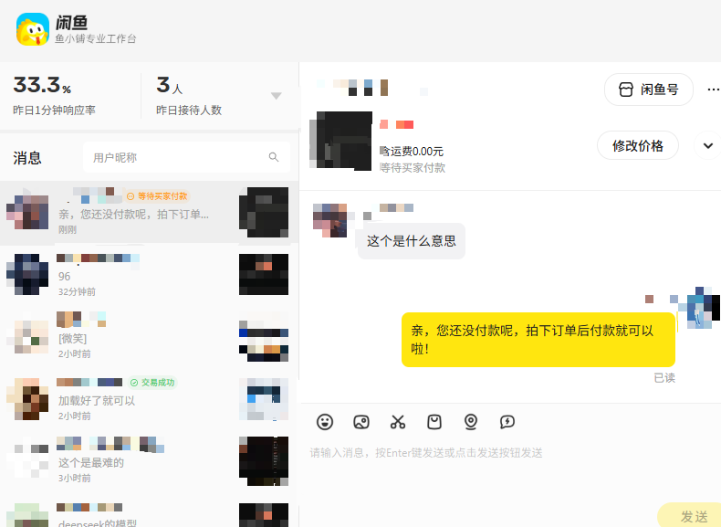
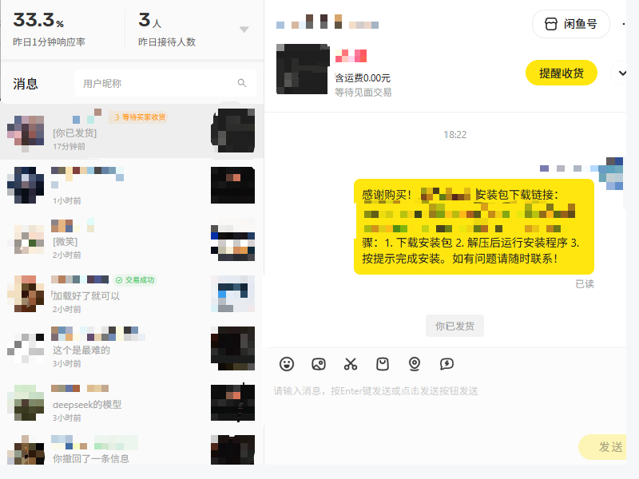
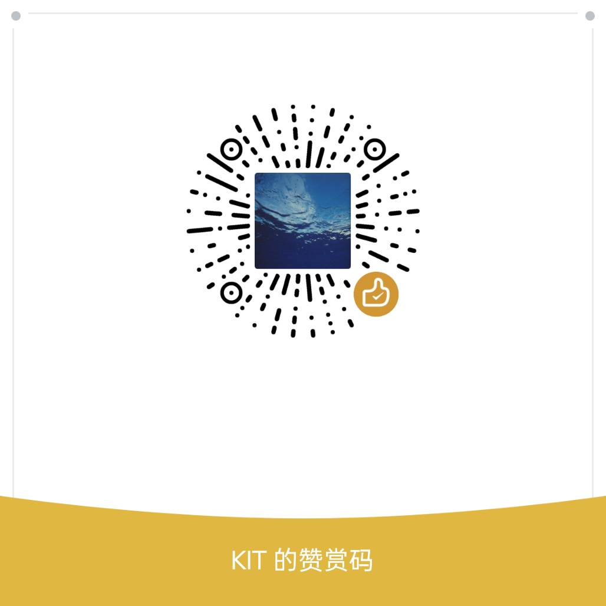

<h1 align="center">🐟 xianyu-seller-cli</h1>

<p align="center">
  <strong>闲鱼卖家客服命令行工具<br>
让 AI Agent 驱动你的闲鱼卖家工作流</strong><br>
</p>

<p align="center">
  <a href="#-快速上手"></a>
  <a href="#-全部命令"></a>
  <a href="LICENSE"></a>
</p>

<p align="center">
  
  
  
</p>

**一行命令**，让闲鱼卖家客服接入 Claude Code、Codex、Cursor、OpenClaw 等 Agent，实现自动化运营闲鱼工作流。

---

## 🤔 为什么是 CLI？

CLI 是人类和 AI Agent 共通的万能接口：

• **结构化、可组合** — 文本命令天然匹配 LLM 的输入格式，可自由串联成复杂工作流

• **轻量且通用** — 几乎零开销，跨平台运行，不依赖额外环境

• **自描述** — 一个 `--help` 就能让 Agent 自动发现所有功能

• **Agent 友好** — 结构化输出，Agent 无需任何额外解析

• **确定且可靠** — 输出稳定一致，行为可预测

## 🚀 快速上手

### 一句话让 Agent 安装

```text
请帮我安装这个skill: https://github.com/goodgooddayhi/xianyu-seller-cli
```

### 环境要求

- **Node.js >= 18**
- **闲鱼卖家客服客户端**（Electron 版）— [点击下载安装](https://mtl.cn-hangzhou.oss.aliyun-inc.com/xianyu/seller/commonpro/xianyu-seller-im-1.0.4-win.exe?spm=a21107h.42826273.0.0.51444ed12pch8s&file=xianyu-seller-im-1.0.4-win.exe)

### 安装

```bash
# 克隆仓库
git clone https://github.com/goodgooddayhi/xianyu-seller-cli.git
cd xianyu-seller-cli

# 安装依赖
npm install

# 全局安装（推荐，可在任意目录使用 xianyu 命令）
npm install -g .
```

### 第一步：启动闲鱼卖家客服

```bash
xianyu launch --exe "C:/path/to/闲鱼卖家客服.exe"
```

### 第二步：开始使用

```bash
# 查看会话列表
xianyu conversations

# 点开会话
xianyu open 3

# 获取聊天消息
xianyu messages

# 发送消息
xianyu send "你好，有什么可以帮您？"
```

## 🎬 效果展示

<div align="center">
  
  <br>
  <em>智能客服自动回复</em>
</div>

<div align="center">
  
  <br>
  <em>虚拟商品自动发货</em>
</div>

## 📖 使用指南

### 会话管理

```bash
xianyu conversations          # 获取会话列表
xianyu open <编号>            # 点开指定会话
xianyu current                # 查看当前会话
xianyu next / prev            # 切换会话
xianyu search <关键词>        # 搜索会话
```

### 消息操作

```bash
xianyu messages               # 获取当前聊天消息
xianyu messages -n 10         # 只显示最近 10 条
xianyu send <text>            # 发送消息
xianyu unread-all             # 查看所有会话未读数
```

### 信息查询

```bash
xianyu buyer-info             # 买家信息（昵称、闲鱼号）
xianyu product-info           # 商品信息（价格、状态）
xianyu stats                  # 统计数据（响应率、接待人数）
xianyu login-check            # 检测登录状态
```

### 订单管理

```bash
xianyu orders                 # 查看订单列表
xianyu orders -s pending      # 查看待发货订单
xianyu ship <订单号> <快递单号>    # 发货（实体商品）
xianyu ship-virtual <订单号>      # 发货（虚拟商品，无需寄件）
```

### 自动发货配置

```bash
xianyu auto-ship-config       # 查看当前配置
xianyu auto-ship-add <商品ID> <SKU>  # 交互式添加规则
xianyu auto-ship-remove <商品ID>    # 删除规则
```

支持按 SKU 区分处理：自动发货 SKU（发网盘链接）和手动处理 SKU（回复预约时间）。

### 辅助功能

```bash
xianyu screenshot             # 截图
xianyu watch                  # 监听新消息
xianyu scroll-up              # 滚动到更早消息
xianyu debug-dom              # DOM 调试
```

## 🧠 智能客服

内置智能客服工作流，Agent 读取 SKILL.md 后可自动执行完整的客服流程：

```
收到消息 → 意图分类 → 专家路由 → 生成回复 → 安全过滤 → 发送
```

### 意图分类

| 类型 | 触发条件 | 示例 |
|------|---------|------|
| 价格类 | 砍价词：多少钱/便宜/优惠/折扣 | "能便宜点吗" |
| 技术类 | 参数词：型号/规格/配置/兼容 | "支持Type-C吗" |
| 默认类 | 其他咨询：物流/售后/问候 | "什么时候发货" |
| 无需回复 | 系统消息/无意义内容 | "[去评价]" |

### 提示词模板

`prompts/` 目录下包含 4 个可自定义的提示词文件：

| 文件 | 用途 |
|------|------|
| `classify_prompt.txt` | 意图分类规则 |
| `price_prompt.txt` | 价格专家策略 |
| `tech_prompt.txt` | 技术专家策略 |
| `default_prompt.txt` | 默认客服策略 |

用户可根据自己的商品类型修改这些模板来定制回复策略。

### 安全过滤

回复内容自动过滤敏感词（联系方式、竞品名称、违规商品等），符合闲鱼社区规范。

## 🤖 Agent 集成

### 安装 Skill

```bash
npx skills add goodgooddayhi/xianyu-seller-cli
```

### 支持的 Agent 平台

| Agent | 安装方式 |
|-------|---------|
| Claude Code | `npx skills add goodgooddayhi/xianyu-seller-cli` |
| OpenClaw | `cp SKILL.md ~/.openclaw/skills/xianyu-seller-cli/SKILL.md` |
| Codex | `cp SKILL.md ~/.codex/skills/xianyu-seller-cli.md` |
| Hermes | `cp SKILL.md ~/.hermes/skills/xianyu-seller-cli.md` |
| Cursor / Windsurf | `cp SKILL.md .cursor/skills/xianyu-seller-cli.md` |

### Agent 自然语言调用示例

| Agent | 用户指令 | 执行命令 |
|-------|---------|---------|
| Claude Code | "查看闲鱼未读消息" | `xianyu unread-all` |
| OpenClaw | "回复最新会话'收到'" | `xianyu conversations` → `xianyu open 1` → `xianyu send "收到"` |
| Codex | "截图当前聊天窗口" | `xianyu screenshot -o chat.png` |
| Hermes | "统计今天的接待数据" | `xianyu stats` |
| Cursor | "搜索叫VViane的会话" | `xianyu search VViane` |

## 📋 全部命令

| 命令 | 说明 | 示例 |
|------|------|------|
| `launch` | 启动闲鱼卖家客服 | `xianyu launch --exe "..."` |
| `status` | 检查连接状态 | `xianyu status` |
| `login-check` | 检测登录状态 | `xianyu login-check` |
| `conversations` | 获取会话列表 | `xianyu conversations` |
| `open <编号>` | 点开会话 | `xianyu open 3` |
| `current` | 当前会话 | `xianyu current` |
| `next` / `prev` | 切换会话 | `xianyu next` |
| `search <关键词>` | 搜索会话 | `xianyu search VViane` |
| `clear-search` | 清除搜索 | `xianyu clear-search` |
| `messages` | 获取聊天消息 | `xianyu messages -n 10` |
| `send <text>` | 发送消息 | `xianyu send "你好"` |
| `buyer-info` | 买家信息 | `xianyu buyer-info` |
| `product-info` | 商品信息 | `xianyu product-info` |
| `stats` | 统计数据 | `xianyu stats` |
| `unread` | 未读消息数 | `xianyu unread` |
| `unread-all` | 所有未读数 | `xianyu unread-all` |
| `scroll-up` | 滚动消息 | `xianyu scroll-up` |
| `emoji` | 表情面板 | `xianyu emoji` |
| `quick-reply` | 快捷回复 | `xianyu quick-reply` |
| `close-tab` | 关闭标签页 | `xianyu close-tab` |
| `watch` | 监听新消息 | `xianyu watch -i 5` |
| `screenshot` | 截图 | `xianyu screenshot -o shot.png` |
| `debug-dom` | DOM 调试 | `xianyu debug-dom -d 4` |
| `orders` | 查看订单 | `xianyu orders -s pending` |
| `ship` | 实体发货 | `xianyu ship <订单号> <快递单号>` |
| `ship-virtual` | 虚拟发货 | `xianyu ship-virtual <订单号>` |
| `auto-ship` | 待发货订单 | `xianyu auto-ship` |
| `auto-ship-virtual` | 待发货虚拟商品 | `xianyu auto-ship-virtual` |
| `auto-ship-config` | 查看自动发货配置 | `xianyu auto-ship-config` |
| `auto-ship-add` | 添加自动发货规则 | `xianyu auto-ship-add <商品ID> <SKU>` |
| `auto-ship-remove` | 删除自动发货规则 | `xianyu auto-ship-remove <商品ID>` |

## 🏗️ 工作原理

```
┌─────────────────────┐     CDP      ┌──────────────────────────┐     HTTPS     ┌─────────────────────┐
│   xianyu-seller-cli │ ───────────▶ │  闲鱼卖家客服 Electron   │ ───────────▶ │  seller.goofish.com │
│   (Node.js CLI)     │ ◀─────────── │  App (浏览器内核)        │ ◀─────────── │  (闲鱼服务端)       │
└─────────────────────┘    DOM操控    └──────────────────────────┘    API通信    └─────────────────────┘
```

## 🙏 特别鸣谢

本项目的智能客服策略参考了以下开源项目：

- [XianyuAutoAgent](https://github.com/shaxiu/XianyuAutoAgent) — 闲鱼 AI 自动回复系统，提供了意图分类和专家路由的方法论

感谢 <a href="https://github.com/shaxiu">@Shaxiu</a> 的技术分享。

## ☕ 请喝咖啡

如果这个项目帮到了你，请作者喝杯咖啡吧！你的支持是持续更新的动力。

<div align="center">
  <table>
    <tr>
      <td align="center"><strong>微信赞赏码</strong></td>
      <td align="center"><strong>支付宝收款码</strong></td>
    </tr>
    <tr>
      <td></td>
      <td></td>
    </tr>
  </table>
</div>

## 📄 License

MIT
